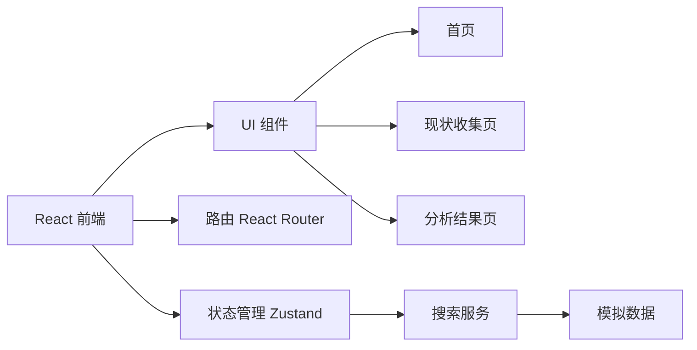

## 1. Architecture Design
前端单页应用架构，使用 React 构建，状态管理采用 zustand，UI 组件库使用 lucide-react 图标。

## 2. Technology Description
- 前端: React@18 + TypeScript + tailwindcss@3 + vite
- 初始化工具: vite-init
- 后端: 无后端服务（前端模拟
- 状态管理: zustand
- 路由: react-router-dom
- 图标库: lucide-react

## 3. Route Definitions
| Route | Purpose |
|-------|---------|
| / | 首页 - 显示开场白 |
| /survey | 现状收集页 - 收集用户基本信息 |
| /analysis | 分析结果页 - 展示职业规划分析结果 |

## 4. API Definitions (if backend exists)
不适用

## 5. Server Architecture Diagram (if backend exists)
不适用

## 6. Data Model (if applicable)
不适用
