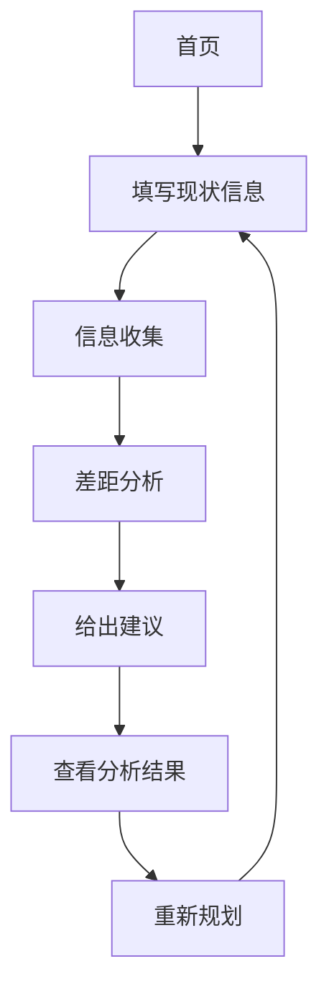

## 1. Product Overview
职业规划顾问是一款帮助职场小白制定职业规划的智能工具应用，提供岗位信息查询、竞争分析、能力规划和路径设计等服务。
- 目标用户：对职场缺乏了解的年轻人，有目标但不知道如何实现
- 核心价值：通过四步流程（了解现状、信息收集、差距分析、给出建议）帮助用户制定清晰可执行的职业发展路径

## 2. Core Features

### 2.1 User Roles (if applicable)
| Role | Registration Method | Core Permissions |
|------|---------------------|------------------|
| Normal User | 无需注册 | 完整使用所有功能，创建和保存职业规划 |

### 2.2 Feature Module
1. **首页**: 开场白展示，开始规划按钮
2. **现状收集页**: 用户基本信息表单收集
3. **分析结果页**: 岗位信息、竞争分析、差距分析、行动建议展示

### 2.3 Page Details
| Page Name | Module Name | Feature description |
|-----------|-------------|---------------------|
| 首页 | 开场白区域 | 显示顾问简介、开场白和开始规划按钮 |
| 现状收集页 | 现状表单 | 收集用户的职业背景、工作经验、核心技能和目标 |
| 分析结果页 | 岗位信息展示 | 显示目标公司/岗位的组织架构、招聘要求、薪资水平和竞争情况 |
| 分析结果页 | 差距分析 | 对比用户现状和目标要求，列出能力差距清单 |
| 分析结果页 | 行动计划 | 提供短期、中期、长期的具体可执行建议 |

## 3. Core Process
用户从首页开始，填写现状信息，系统进行信息收集和分析，最后展示分析结果和行动计划。

## 4. User Interface Design
### 4.1 Design Style
- 主色调：深蓝色 (#1e40af) 和浅蓝色 (#3b82f6)，传达专业和信任感
- 辅助色：暖橙色 (#f59e0b) 用于强调和行动按钮
- 按钮风格：圆角矩形，有明显的悬停和点击反馈
- 字体：Inter 字体系统，标题使用 24-32px，正文 14-16px
- 布局风格：卡片式布局，清晰的内容分区
- 图标风格：简洁线性图标，来自 lucide-react

### 4.2 Page Design Overview
| Page Name | Module Name | UI Elements |
|-----------|-------------|-------------|
| 首页 | 开场白区域 | 渐变背景，卡片悬浮效果，平滑入场动画 |
| 现状收集页 | 现状表单 | 多步骤表单，垂直布局，输入框带聚焦动画 |
| 分析结果页 | 岗位信息展示 | 标签页切换，数据卡片网格，加载动画 |
| 分析结果页 | 差距分析 | 进度条展示差距，对比卡片，关键指标高亮 |
| 分析结果页 | 行动计划 | 时间线布局，可展开详情，高亮重点建议 |

### 4.3 Responsiveness
桌面优先设计，适配平板和移动设备，移动端采用单列布局，触摸优化的按钮大小。

### 4.4 3D Scene Guidance (if applicable)
不适用
