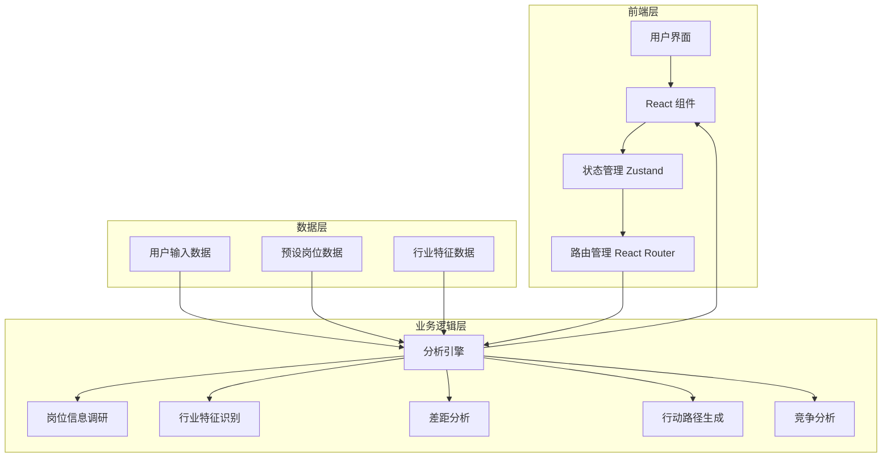
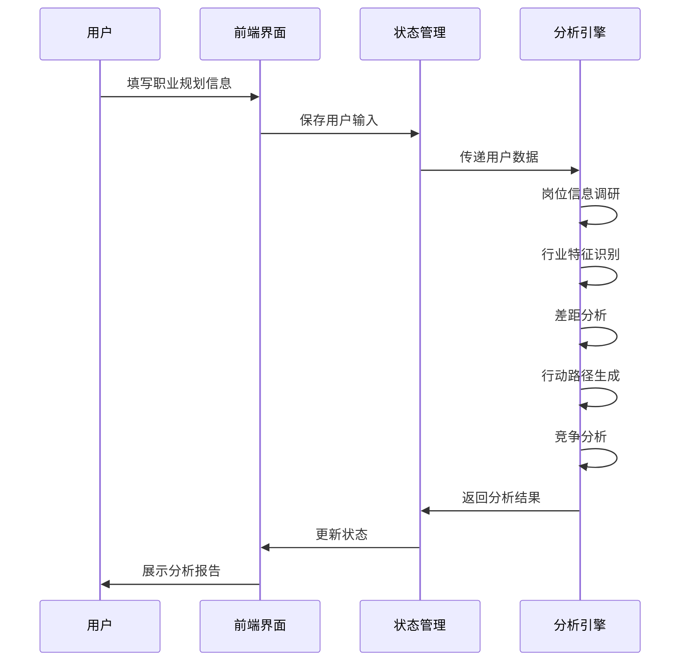

# 职业规划智能体 (Career Planning Agent)

一个基于 React + TypeScript 的智能职业规划工具，通过数据驱动的分析方法，帮助用户制定个性化的职业发展路径。

## 🎯 项目立意

**背景**：职场人士在职业发展过程中常常面临方向不明确、能力差距不清晰、行动路径模糊等问题。

**目标**：通过系统化的分析方法，为用户提供客观、个性化的职业规划建议，帮助用户清晰认识自身现状与目标岗位的差距，并提供可执行的行动方案。

**价值**：降低职业规划的门槛，让更多人能够科学规划自己的职业发展，提高职业竞争力。

## ✨ 创新点与亮点

### 1. 智能化岗位信息调研
- **动态岗位分析**：根据用户输入的目标岗位，自动生成相关技能要求和职责描述
- **行业特征识别**：智能识别岗位所属行业类型，提供针对性的分析内容
- **个性化匹配**：结合用户实际情况，生成符合个人背景的分析结果

### 2. 精细化差距分析
- **多维度能力评估**：从硬技能、软技能等多个维度进行全面分析
- **量化差距程度**：通过具体指标评估能力差距，提供直观的差距可视化
- **难度评估**：基于差距程度，预估补足所需时间和难度

### 3. 差异化行动路径
- **岗位类型适配**：为不同岗位类型（技术、设计、运营、行政等）提供定制化行动建议
- **阶段式规划**：短期、中期、长期行动路径，循序渐进
- **具体可执行**：提供详细的学习资源、时间安排和行动步骤

### 4. 数据驱动的竞争分析
- **岗位供需分析**：评估目标岗位的竞争激烈程度
- **竞争者画像**：分析典型竞争者的背景和能力要求
- **个人竞争力评估**：客观分析用户的优势和劣势

## 📊 系统架构



## 🔄 数据流图



## 🛠 技术实现

### 核心技术栈
- **前端框架**：React 18 + TypeScript
- **构建工具**：Vite
- **样式方案**：Tailwind CSS
- **状态管理**：Zustand
- **路由管理**：React Router
- **图标库**：Lucide React
- **代码质量**：ESLint + TypeScript

### 关键模块
1. **信息收集模块**：用户输入界面，收集职业背景和目标信息
2. **分析引擎模块**：核心业务逻辑，执行岗位分析和差距评估
3. **结果展示模块**：可视化分析结果，展示行动路径和建议
4. **数据管理模块**：状态管理，处理用户数据和分析结果

## 📦 安装和运行

### 环境要求
- Node.js 18.0 或更高版本
- npm 或 yarn

### 安装步骤

1. **克隆仓库**
   ```bash
   git clone https://github.com/Ryan-shangzhi/career-planning-agent.git
   cd career-planning-agent
   ```

2. **安装依赖**
   ```bash
   npm install
   # 或
   yarn install
   ```

3. **启动开发服务器**
   ```bash
   npm run dev
   # 或
   yarn dev
   ```

4. **构建生产版本**
   ```bash
   npm run build
   # 或
   yarn build
   ```

## 📁 项目结构

```
├── src/
│   ├── components/     # 通用组件
│   ├── hooks/          # 自定义钩子
│   ├── lib/            # 工具库
│   ├── pages/          # 页面组件
│   │   ├── Home.tsx    # 首页
│   │   ├── Survey.tsx  # 信息收集页
│   │   └── Analysis.tsx # 分析结果页
│   ├── store/          # 状态管理
│   ├── utils/          # 工具函数
│   │   └── analysis.ts # 分析逻辑
│   ├── App.tsx         # 应用入口
│   ├── main.tsx        # 渲染入口
│   └── index.css       # 全局样式
├── public/             # 静态资源
├── .trae/              # 项目文档
├── package.json        # 项目配置
└── vite.config.ts      # Vite 配置
```

## 📖 使用流程

1. **访问应用**：打开浏览器，访问 `http://localhost:5173`

2. **填写信息**：在首页点击「开始规划我的职业」按钮，进入信息收集页面

3. **提交信息**：填写当前职业、工作经验、核心技能、目标公司、目标岗位等信息

4. **查看分析**：提交后，系统会生成详细的职业规划分析报告

5. **分析报告包含**：
   - 目标岗位能力图谱
   - 目标公司/行业人员要求
   - 用户差距分析表
   - 具体行动路径
   - 竞争力度分析
   - 晋升路径预览

## 🚢 部署方案

### Vercel 部署
1. 访问 [Vercel](https://vercel.com/)
2. 点击「Add New」→「Project」
3. 选择「Import Git Repository」
4. 选择 `career-planning-agent` 仓库
5. 点击「Deploy」
6. 部署完成后，Vercel 会提供一个公开访问的 URL

### Netlify 部署
1. 访问 [Netlify](https://www.netlify.com/)
2. 点击「Add new site」→「Import an existing project」
3. 选择「GitHub」并授权
4. 选择 `career-planning-agent` 仓库
5. 配置构建命令：`npm run build`
6. 配置发布目录：`dist`
7. 点击「Deploy site」

## 🤝 贡献方式

1. **Fork 仓库**
2. **创建分支**：`git checkout -b feature/your-feature`
3. **提交更改**：`git commit -m "Add your feature"`
4. **推送到分支**：`git push origin feature/your-feature`
5. **创建 Pull Request**

## 📄 许可证

MIT License

## 📞 联系方式

- GitHub: [Ryan-shangzhi](https://github.com/Ryan-shangzhi)

---

**科学规划职业，成就美好未来！** 🎯