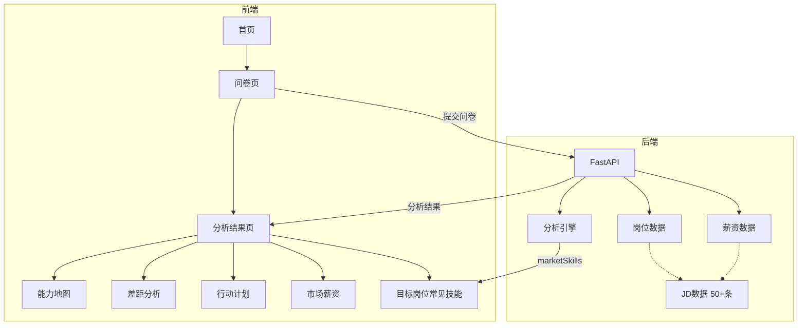
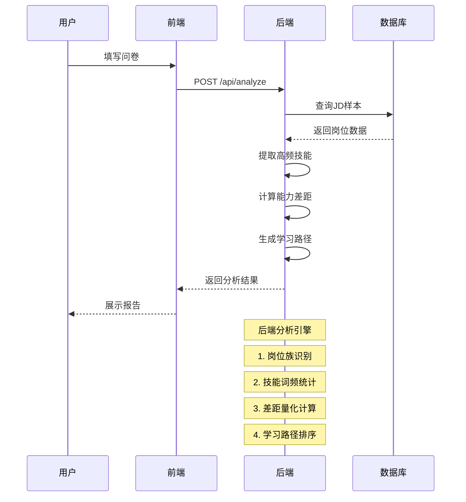

# 职业规划顾问

一个帮助职场新人或转行者了解目标岗位真实能力要求的工具。用户填写现状和目标，系统结合招聘数据生成能力差距分析和学习建议。

**核心逻辑**：爬取真实招聘数据 → 问卷采集用户背景 → 生成差距分析报告 → 输出学习路径建议

## 项目立意

很多人准备转行或晋升时，面临的问题是：目标岗位到底需要什么技能？网上攻略要么太笼统，要么太主观。这个工具尝试用真实招聘数据来回答这个问题——从招聘JD中提取高频技能要求，对比用户的实际技能，给出差距清单和学习建议。

适合谁用：对目标岗位了解不多，想知道"我离这个岗位还差什么"的人。

不适合谁：已经有明确方向的人，需要深度行业洞察的人。

## 系统架构


```mermaid
flowchart TD
    subgraph 前端
        A[首页] --> B[问卷页]
        B --> C[分析结果页]
        C --> D[能力地图]
        C --> E[差距分析]
        C --> F[行动计划]
        C --> G[市场薪资]
        C --> H[目标岗位常见技能]
    end

    subgraph 后端
        I[FastAPI] --> J[岗位数据]
        I --> K[薪资数据]
        I --> L[分析引擎]
        J -.-> M[JD数据 50+条]
        K -.-> M
    end

    B -->|提交问卷| I
    I -->|分析结果| C
    L -->|marketSkills| H
```

## 数据流


```mermaid
sequenceDiagram
    participant U as 用户
    participant F as 前端
    participant B as 后端
    participant D as 数据库

    U->>F: 填写问卷
    F->>B: POST /api/analyze
    B->>D: 查询JD样本
    D-->>B: 返回岗位数据
    B->>B: 提取高频技能
    B->>B: 计算能力差距
    B->>B: 生成学习路径
    B-->>F: 返回分析结果
    F-->>U: 展示报告

    Note over B: 后端分析引擎
    Note over B: 1. 岗位族识别
    Note over B: 2. 技能词频统计
    Note over B: 3. 差距量化计算
    Note over B: 4. 学习路径排序
```

## 核心功能

| 功能 | 说明 |
|------|------|
| 岗位匹配 | 根据用户目标匹配招聘数据库中的相似岗位 |
| 能力差距分析 | 对比用户技能与岗位要求，量化差距程度 |
| 行动计划 | 生成短期/中期/长期学习路径 |
| 薪资参考 | 显示目标岗位的市场薪资范围 |
| 目标岗位常见技能 | 根据岗位族显示市场高频技能 |

## 技术栈

- 前端：React 18 + TypeScript + Tailwind CSS + Zustand
- 后端：FastAPI + SQLite
- 爬虫：Playwright（招聘数据采集）
- 开发工具：Vite + ESLint

## 快速启动

```bash
# 前端
npm install
npm run dev

# 后端（另一个终端）
cd backend
pip install -r requirements.txt
python -m uvicorn main:app --port 8000
```

访问 http://localhost:5173

## 目录结构

```
├── src/                    # 前端源码
│   ├── pages/              # 页面组件
│   │   ├── Home.tsx       # 首页
│   │   ├── Survey.tsx     # 问卷页
│   │   └── Analysis.tsx   # 分析结果页
│   ├── store/              # 状态管理
│   └── services/           # API 调用
├── backend/                # 后端源码
│   ├── main.py            # FastAPI 主文件
│   ├── models.py          # 数据模型
│   ├── database.py        # 数据库操作
│   └── data/              # JD 数据
└── public/                 # 静态资源
```

## 数据来源

招聘数据来自登链社区等公开招聘平台，包含50+条后端、前端、产品等岗位的JD样本。数据仅用于技能分析和薪资统计。

## 已知局限

- JD样本量有限，技能分析可能不完整
- 薪资数据来源于有限样本，仅供参考
- 爬虫受限于目标网站的反爬策略
- 不同地区的岗位数据差异未考虑

## License

MIT
